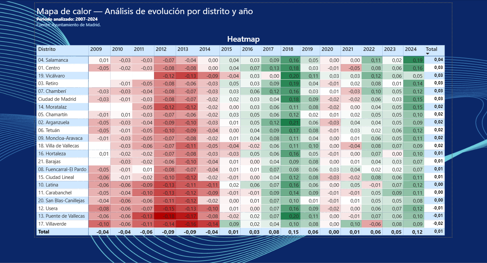

🏙️ Real Estate Market Analysis – Madrid (2007–2024)

Análisis completo del mercado inmobiliario en Madrid utilizando Power BI, con limpieza de datos, modelado, visualización avanzada y conclusiones orientadas a negocio.

📌 Objetivo del proyecto

Comprender la evolución del precio por m² en los distritos de Madrid entre 2007 y 2024, identificando:

- Variación anual del mercado
- Distritos con mayor y menor crecimiento
- Patrones de comportamiento por zona
- Tendencias útiles para compradores, inversores y analistas

📸 Vista previa del dashboard

🟦 Página 1 — Ranking de precios por distrito

🟦 Página 2 — Mapa de calor por distrito y año

🟦 Página 3 — Conclusiones clave + Variación YoY

🧠 Conclusiones clave

- El distrito con mayor crecimiento acumulado es Salamanca (+3,43%).
- El distrito con peor evolución es Villaverde (-1,0%).
- El mejor año del mercado fue 2018 (+14,81%).
- El peor año fue 2012 (-9,32%).
- La tendencia general del mercado es alcista, con un crecimiento medio anual del 1,99%.

🔍 Proceso del análisis

1. Recolección del dataset
Datos oficiales del Ayuntamiento de Madrid:
https://servpub.madrid.es/CSEBD_WBINTER/seleccionSerie.html?numSerie=0504030000152

2. Limpieza y transformación

- Normalización de columnas
- Corrección de valores atípicos
- Estandarización de distritos y fechas
- Eliminación de inconsistencias

3. Modelado en Power BI

- Relaciones entre tablas
- Creación de medidas DAX
- Segmentación por distrito y año
- Cálculo de variación YoY y acumulada

4. Visualización

- Ranking de precios por distrito
- Mapa de calor de evolución anual
- Conclusiones automáticas generadas con DAX
- Tema visual estilo consultora

📂 Estructura del repositorio

Código

Real-Estate-Madrid-Analysis/

│── README.md

│── Datos inmobiliarios.pbix

│── Datos inmobiliarios - Visualizacion.pdf

│── Images/

│     ├── pagina1_ranking.png

│     ├── pagina2_heatmap.png

│     ├── pagina3_insights.png

│── Dataset/

      ├── Precios historicos Madrid.xlsx

📎 Archivos incluidos

- Datos inmobiliarios.pbix → Dashboard final
- Datos inmobiliarios - Visualizacion.pdf → Informe exportado
- Dataset/ → Datos originales
- Images/ → Capturas del dashboard

📚 Aprendizajes

- Diseño de dashboards con enfoque consultivo
- Creación de medidas DAX para análisis dinámico
- Limpieza y normalización de datos reales
- Documentación clara del proceso analítico

📫 Contacto

LinkedIn: https://www.linkedin.com/in/mar-sanchez-g/  
Email: marsanchez095@gmail.com
