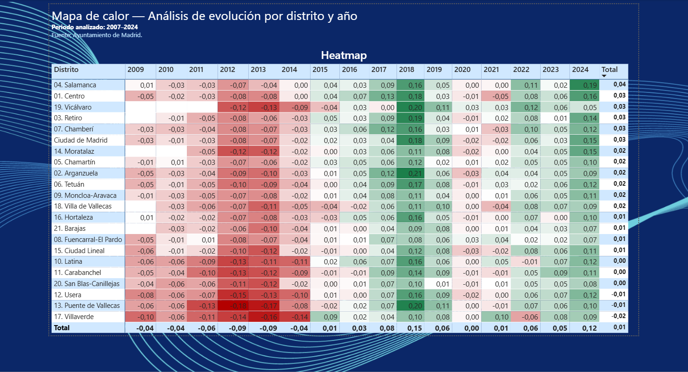

# Real Estate Market Analysis – Madrid (2007–2024)

Analysis of the real estate market in Madrid using Google Sheets and Power BI, including data cleaning, modeling, advanced visualization, and business‑oriented insights.

## Project Objective

Understand the evolution of the price per square meter (m²) across Madrid’s districts between 2007 and 2024, identifying:

- Annual market variation
- Districts with the highest and lowest growth
- Behavioral patterns by area
- Trends useful for buyers, investors, and analysts

## Dashboard Preview

🟦 Page 1 — District Price Ranking

🟦 Page 2 — Heatmap by District and Year

🟦 Page 3 — Key Insights + YoY Variation

## Key Insights

- The district with the highest cumulative growth is Salamanca (+3.43%).
- The district with the weakest performance is Villaverde (-1.0%).
- The best market year was 2018 (+14.81%).
- The worst year was 2012 (-9.32%).
- The overall market trend is upward, with an average annual growth of 1.99%.

## Analysis Process

1. Dataset Collection (CSV)  
Official data from the Madrid City Council:
https://servpub.madrid.es/CSEBD_WBINTER/seleccionSerie.html?numSerie=0504030000152

2. Cleaning and Transformation in Google Sheets and Power Query

- Column normalization
- Outlier correction
- Standardization of districts and dates
- Removal of inconsistencies

 3. Modeling in Power BI

- Table relationships
- Creation of DAX measures
- Segmentation by district and year
- Calculation of YoY and cumulative variation

4. Visualization

- District price ranking
- Annual evolution heatmap
- Automatic insights generated with DAX
- Consulting‑style visual theme

## Repository Structure
Code: Real-Estate-Madrid-Analysis/

/Images
  Process visuals:
  - Conclusiones y tendencia.png
  - Heatmap.png
  - Modelo de estrella.png
  - Plantilla de precios de Madrid en bruto.png
  - Ranking por distritos.png
  - Tabla transformada.png
  - Tablas.png

/dataset
  Files used:
  - Datos inmobiliarios - Visualizacion.pdf
  - Datos inmobiliarios.pbix
  - Precios historicos Madrid - Ayuntamiento.xlsx

README.md

## 📎 Included Files

- Datos inmobiliarios.pbix → Final dashboard
- Datos inmobiliarios - Visualizacion.pdf → Exported report
- dataset/ → Original data
- Images/ → Dashboard screenshots

## Learnings

- Dashboard design with a consulting‑oriented approach
- Creation of DAX measures for dynamic analysis
- Cleaning and normalization of real‑world data
- Clear documentation of the analytical process

 

## Conclusions

### Why Are Prices Increasing?

The analysis suggests that the long-term increase in Madrid's housing prices is primarily related to the interaction between growing demand and relatively limited housing supply. However, housing prices are also influenced by broader economic and financial conditions that affect households' purchasing capacity, access to credit, and investment decisions.

Several structural and macroeconomic factors may help explain the evolution of the market:

* **Growing demand:** Madrid continues to attract population, employment, and economic activity, increasing demand for housing.

* **Limited housing supply:** New housing construction has not always kept pace with demand, creating persistent upward pressure on prices.

* **Limited availability of land:** The availability and development of suitable land constrain the ability to increase housing supply quickly, particularly in areas with strong demand.

* **Lower interest rates:** The reduction in European interest rates has improved financing conditions compared with the high-rate environment of 2023–2024. The ECB's main refinancing rate fell from 4.25% in June 2024 to 2.40% in June 2026, reducing the cost of bank funding and supporting a gradual improvement in financing conditions.

* **Improved economic conditions:** Following the severe contraction of the Spanish economy in 2020, economic activity recovered strongly. Spain's GDP grew by 5.5% in 2021 and, following subsequent statistical revisions, 6.2% in 2022. A stronger economic environment can support housing demand by improving employment, household income expectations, and consumer confidence.

* **Lower unemployment:** Spain's unemployment rate declined from 15.53% in 2020 to 12.92% in 2022, indicating a significant improvement in labour-market conditions during the recovery period.

* **Improved access to mortgage financing:** As financing conditions improve, more households may regain access to mortgage credit or become willing to enter the housing market. This can increase effective demand, particularly when combined with relatively limited housing supply.

* **Construction costs:** Higher construction and material costs can increase the final cost of new housing and reduce the speed at which new supply can enter the market.

* **Economic concentration:** Madrid's position as a major economic and employment centre increases its attractiveness to workers, businesses, and investors, supporting sustained housing demand.

* **Investment demand:** Housing can also attract investors seeking long-term returns, adding another source of demand, particularly in areas with strong rental markets and expectations of capital appreciation.

These factors should not be interpreted as individual causes derived directly from the dataset. The project identifies historical price patterns, while the broader economic interpretation is supported by external research and macroeconomic indicators from institutions such as the Banco de España, the ECB, and the INE.

However, this projection should be treated as a **scenario based on historical trends, rather than a definitive price forecast**. A more robust forecasting model would require additional variables such as interest rates, population growth, income, construction activity, mortgage lending, and employment.

This represents an opportunity for further analysis and model development.

Contact

LinkedIn: https://www.linkedin.com/in/mar-sanchez-g/  
Email: marsanchez095@gmail.com

# Castellano

# Analisis de mercado inmobiliario – Madrid (2007–2024)

Análisis del mercado inmobiliario en Madrid utilizando Sheets y Power BI, con limpieza de datos, modelado, visualización avanzada y conclusiones orientadas a negocio.

## Objetivo del proyecto

Comprender la evolución del precio por metro cuadrado (m²) en los distritos de Madrid entre 2007 y 2024, identificando:

- Variación anual del mercado
- Distritos con mayor y menor crecimiento
- Patrones de comportamiento por zona
- Tendencias útiles para compradores, inversores y analistas

## Vista previa del Panel de visualización

🟦 Página 1 — Ranking de precios por distrito

🟦 Página 2 — Mapa de calor por distrito y año

🟦 Página 3 — Conclusiones clave + Variación YoY

## Conclusiones clave

- El distrito con mayor crecimiento acumulado es Salamanca (+3,43%).
- El distrito con peor evolución es Villaverde (-1,0%).
- El mejor año del mercado fue 2018 (+14,81%).
- El peor año fue 2012 (-9,32%).
- La tendencia general del mercado es alcista, con un crecimiento medio anual del 1,99%.

## Proceso del análisis

1. Recolección del dataset CSV
Datos oficiales del Ayuntamiento de Madrid:
https://servpub.madrid.es/CSEBD_WBINTER/seleccionSerie.html?numSerie=0504030000152

2. Limpieza y transformación en Google Sheets y Power Query

- Normalización de columnas
- Corrección de valores atípicos
- Estandarización de distritos y fechas
- Eliminación de inconsistencias

3. Modelado en Power BI

- Relaciones entre tablas
- Creación de medidas DAX
- Segmentación por distrito y año
- Cálculo de variación YoY y acumulada

4. Visualización

- Ranking de precios por distrito
- Mapa de calor de evolución anual
- Conclusiones automáticas generadas con DAX
- Tema visual estilo consultora

## Estructura del repositorio

Código: Real-Estate-Madrid-Analysis/

/Images
 Capturas del proceso:
- Conclusiones y tendencia.png
- Heatmap.png
- Modelo de estrella.png
- Plantilla de precios de Madrid en bruto.png
- Ranking por distritos.png
- Tabla transformada.png
- Tablas.png

/ dataset
 Archivos utilizados
- Datos inmobiliarios - Visualizacion.pdf
- Datos inmobiliarios.pbix
- Precios historicos Madrid - Ayuntamiento.xlsx

 README.md

## Archivos incluidos

- Datos inmobiliarios.pbix → Dashboard final
- Datos inmobiliarios - Visualizacion.pdf → Informe exportado
- Dataset/ → Datos originales
- Images/ → Capturas del dashboard

## Aprendizajes

- Diseño de dashboards con enfoque consultivo
- Creación de medidas DAX para análisis dinámico
- Limpieza y normalización de datos reales
- Documentación clara del proceso analítico

 Contacto

LinkedIn: https://www.linkedin.com/in/mar-sanchez-g/  
Email: marsanchez095@gmail.com
